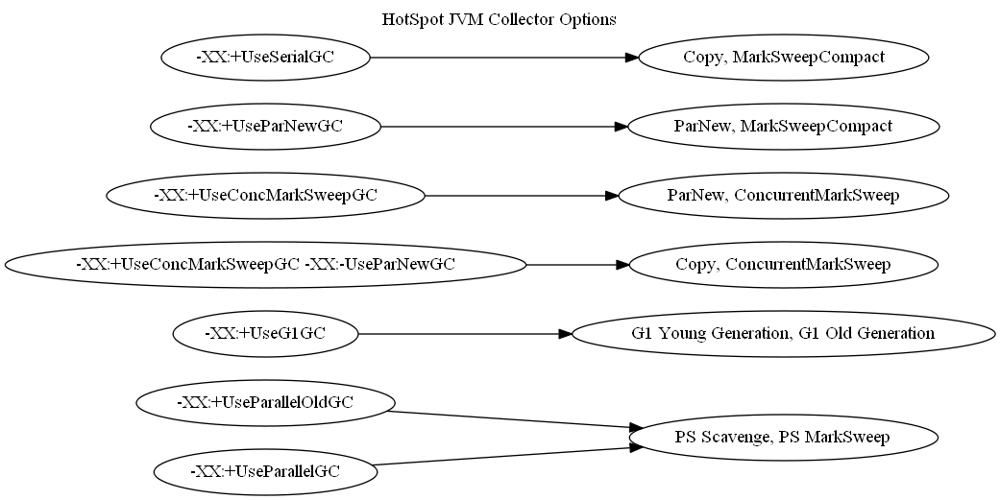

# HotSpot JVM Collectors #

I was curious about how different JVM garbage collector command line options mapped to actual
selections in the virtual machine at runtime.  _Note: all of my testing was using Oracle JDK 1.8.0_60,
but the update number (60 in this case) shouldn't matter._

According to Oracle's GC Tuning Guide, these are the available GC selection command line options:

* `-XX:+UseConcMarkSweepGC`
* `-XX:+UseG1GC`
* `-XX:+UseParallelGC`
* `-XX:+UseParallelOldGC`
* `-XX:+UseParNewGC` and `-XX:-UseParNewGC`
* `-XX:+UseSerialGC`

For example, you'd use the following options with the `java` executable for selecting the CMS collector:

`java -XX:+UseConcMarkSweepGC -XX:+UseParNewGC`

And the JVM would select the `ParNew` young and `ConcurrentMarkSweep` old generation collectors,
as named by the `GarbageCollectorMXBean`:

`ParNew, ConcurrentMarkSweep`

`GraphCollectors` is a short program that [outputs a directed graph](collectors.gv) using the DOT graph language.
It creates combinations of GC options, and uses them to construct a command line for starting an external JVM
process that prints actual collector settings to stdout.

### Running the program ###

Use the following Maven Wrapper command line to run the program, which outputs a graph to stdout:

`$ mvnw compile exec:exec`

### Rendering the graph ###

You'll need to download and install Graphviz [here](http://www.graphviz.org/Download.php).

Render the graph using the following command line:

`$ dot -Tpng collectors.gv > collectors.png`

### Results ###

There are 7 combinations of GC command line options, mapping to 6 young and old collectors
at runtime.  This means, for example, that it's not strictly necessary to pass
`-XX:+UseConcMarkSweepGC -XX:+UseParNewGC` to select the `ParNew` collector: the JVM will do
that by default!

### References ###

1. [HotSpot JVM GC Tuning Guide](https://docs.oracle.com/javase/8/docs/technotes/guides/vm/gctuning/collectors.html#sthref28)

2. [MXBean Javadoc](http://docs.oracle.com/javase/8/docs/api/javax/management/MXBean.html)

3. [GarbageCollectorMXBean Javadoc](http://docs.oracle.com/javase/8/docs/api/java/lang/management/GarbageCollectorMXBean.html)

4. [A great blog post by Jon Masamitsu](https://blogs.oracle.com/jonthecollector/entry/our_collectors)